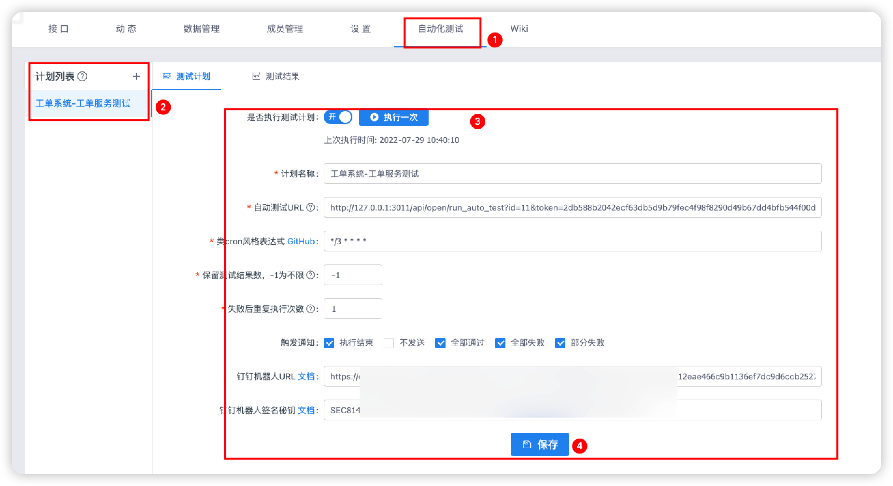
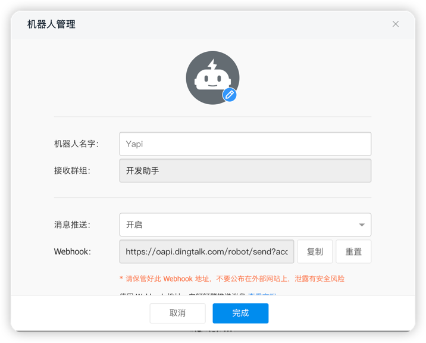
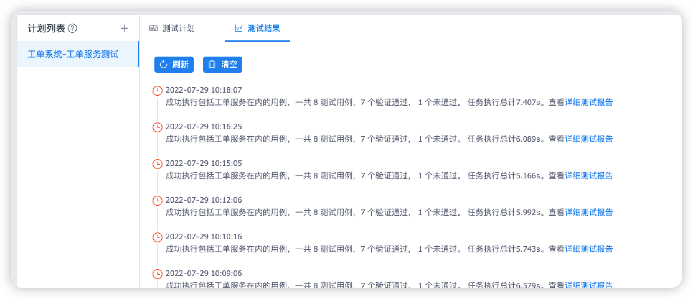

# yapi-plugin-automated-test
> Yapi插件-自动化测试插件

定时自动测试插件旨在提供更方便的接口测试功能，更高效的接口健康监测。

充分释放人力、物力，节省接口回归时间，减少其他资源投入。

### 简介

Github:[yapi-plugin-automated-test](https://github.com/gclm/yapi-plugin-automated-test)

插件安装后，在分组的项目导航栏中加入*自动化测试*标签，配置非常简单。使用过程中如果碰到任何bug或有任何好的的建议欢迎issue。

### 功能

- 支持多计划配置，可以基于测试集合配置不同的测试计划，定制化程度高
- 支持定时自动测试，开启后会定时执行，并推送钉钉群机器人消息
- 支持多情况消息推送，主要控制钉钉机器人推送消息方式
- 服务端自动化测试URL直接使用Yapi自带的测试集合自动化测试
- 时间轴风格的测试结果列表，支持直接查看历史测试结果。
- 钉钉机器人配置钉钉自定义机器人的webhook，注意钉钉机器人安全控制-需要配置钉钉机器人安全秘钥
- cron表达式，用于自动测试的频率，自动测试后会发送钉消息，[参考](https://duicym.github.io/2020/12/08/node-schedule%E7%9A%84%E5%AE%9A%E6%97%B6%E4%BB%BB%E5%8A%A1%E8%A1%A8%E8%BE%BE%E5%BC%8F/)

### 安装插件

#### 正常安装

1. 在config.json这层目录下运行 `yapi plugin --name yapi-plugin-automated-test`安装插件
2. 重启yapi

#### 本地安装

1. 下载插件clone到本地，拷贝到Yapi目录的`项目目录/vendors/node_modules/`下面
2. 修改配置文件，Yapi目录下`项目目录/config.json`,添加插件
3. 打包后重启服务，ykit的打包命令`ykit pack -m`

### 更新插件

通过yapi-cli更新插件还是比较麻烦的，直接再执行一次命令并不会更新。因为yapi-cli安装插件实际上就是在vendors目录下执行`npm install --registry https://registry.npm.taobao.org yapi-plugin-automated-test`
，所以最后会在package.json文件中记录下开始安装的版本号，再次执行安装的还是同一个版本。

执行如下操作可以进行更新：

1. 需要先清除ykit的缓存，删除`./vendors/node_modules/.ykit_cache`文件夹
2. 修改package.json里面`yapi-plugin-automated-test`的版本或者直接`npm i yapi-plugin-automated-test@version`
3. 在`./vendors/`目录中执行命令`NODE_ENV=production ykit pack -m`
4. 在config.json这层目录下执行命令`yapi plugin --name yapi-plugin-automated-test`后再重启服务器就完成安装指定版本的插件

### 如何使用

#### 1、如何维护测试集合

官方中文教程比较详细，并且有动图，[官方教程](https://hellosean1025.github.io/yapi/documents/case.html)

#### 2、如何配置插件

1. 配置入口在项目的导航栏中。
   
2. 服务端自动化测试URL获取，通过测试集合-》服务端测试获取URL，直接使用。
   
3. 配置钉钉群机器人webhook。
   

#### 3、如何查看结果

1. 通过Yapi项目-》动态，项目动态
   

2. 钉钉群聊里的钉钉机器人
   

3. 测试结果
   

### 注意事项

1. 钉钉每个机器人每分钟最多发送20条，参考[消息发送频率限制](https://ding-doc.dingtalk.com/doc#/serverapi2/qf2nxq)

